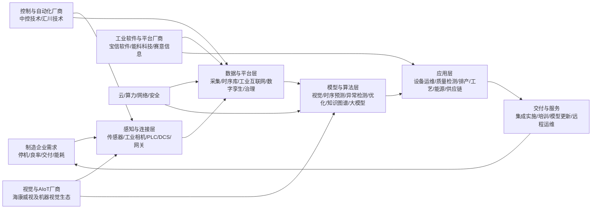

# 工业 AI 产业链结构图

```mermaid
flowchart LR
  A[制造企业需求\n停机/良率/交付/能耗] --> B[感知与连接层\n传感器/工业相机/PLC/DCS/网关]
  B --> C[数据与平台层\n采集/时序库/工业互联网/数字孪生/治理]
  C --> D[模型与算法层\n视觉/时序预测/异常检测/优化/知识图谱/大模型]
  D --> E[应用层\n设备运维/质量检测/排产/工艺/能源/供应链]
  E --> F[交付与服务\n集成实施/培训/模型更新/远程运维]
  F --> A
  G[控制与自动化厂商\n中控技术/汇川技术] --> B
  G --> C
  H[工业软件与平台厂商\n宝信软件/能科科技/赛意信息] --> C
  H --> E
  I[视觉与AIoT厂商\n海康威视及机器视觉生态] --> B
  I --> D
  J[云/算力/网络/安全] --> C
  J --> D
```

## 读图方法

- **硬件入口**决定数据可得性和控制实时性；
- **平台层**决定数据能否跨设备、跨产线复用；
- **模型层**决定预测、识别和优化能力；
- **应用与服务层**决定 ROI 能否进入生产流程并持续收费；
- 公司可能横跨多个环节，不能按单一标签判断竞争关系。
